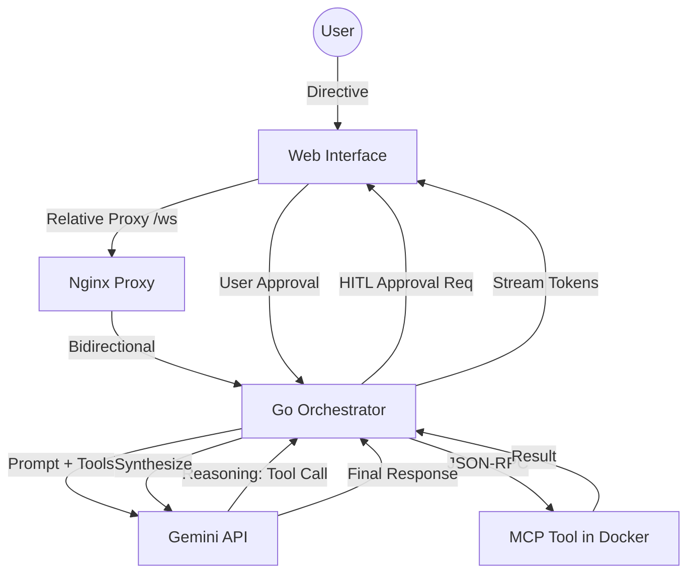

# Business Flow: AI Oak Orchestrator

## Overview
The AI Oak Orchestrator is a strategic middleware platform that bridges high-level LLM reasoning with low-level, containerized tool execution. It utilizes a "Human-in-the-Loop" (HITL) gateway to ensure autonomous actions are authorized by the user before execution.

## Core Logic Path
1. **User Initiation**: User sends a mission directive via the Web Interface.
2. **Reasoning Loop**: The Backend Orchestrator queries Gemini with the current conversation history and available MCP tool schemas.
3. **HITL Interception**: If Gemini requests a tool, the Orchestrator pauses and broadcasts an approval event to the UI.
4. **Execution**: Upon user authorization, the Orchestrator executes the tool within an isolated Docker container via the Model Context Protocol.
5. **Feedback Loop**: Tool results are synthesized by Gemini to produce a final response or determine the next required action.
6. **Error Awareness**: If service limits (e.g., API quotas) are hit, the system immediately propagates a formatted error to the user interface.

## Stakeholder Logic Diagram

