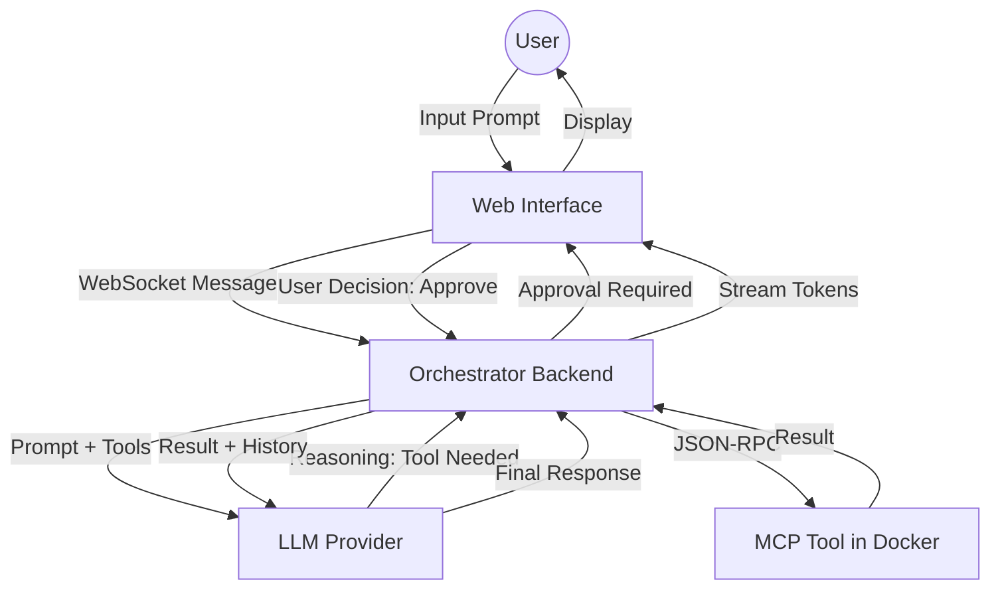

# Business Flow: AI Oak Orchestrator

## Overview
The AI Oak Orchestrator is a strategic middleware platform designed to bridge high-level LLM reasoning with low-level, containerized tool execution. It follows a "Human-in-the-Loop" (HITL) philosophy, ensuring that autonomous agent actions are always subject to user oversight for sensitive operations.

## Core Logic Path
1. **Initiation**: A user starts a session via the Web Interface.
2. **Reasoning Loop**: The backend Orchestrator queries the LLM with the user prompt and a list of available MCP tools.
3. **Tool Identification**: If the LLM determines a tool is needed, it issues a "Tool Call" request.
4. **Human-in-the-Loop Approval**: The Orchestrator intercepts the Tool Call and sends an approval request to the Web Interface.
5. **Execution**: Upon user approval, the Orchestrator executes the tool within an isolated Docker container via the Model Context Protocol (MCP).
6. **Synthesis**: Tool results are fed back to the LLM to generate the final response or continue the reasoning loop.

## Stakeholder Logic Diagram

